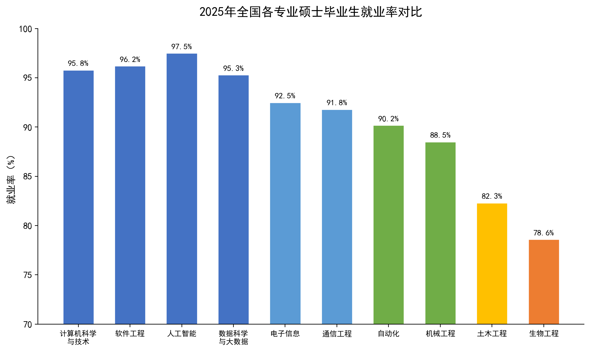
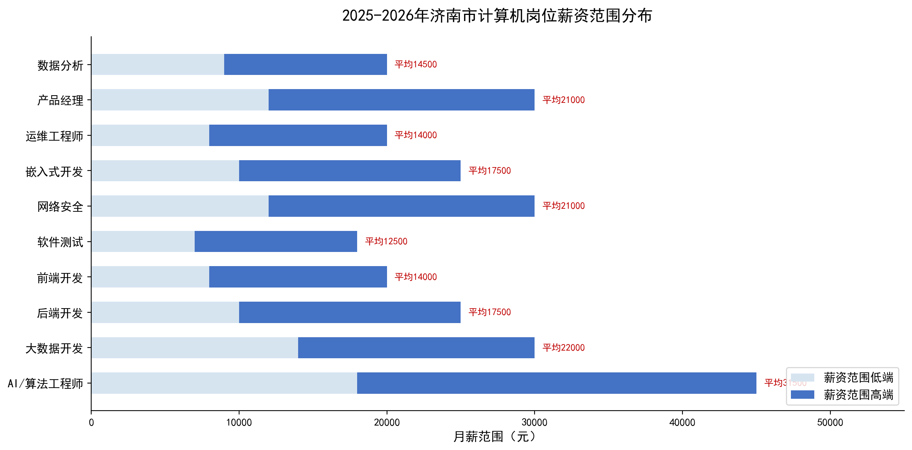
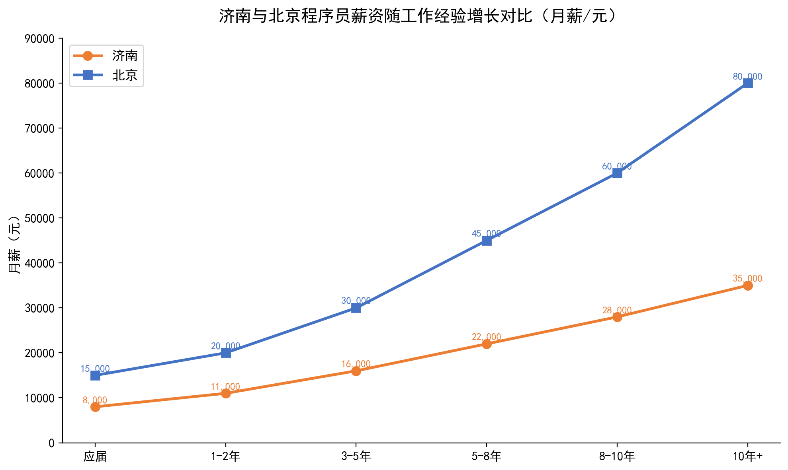
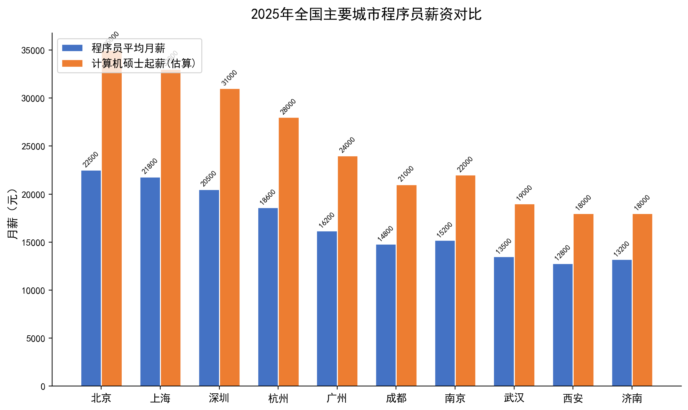
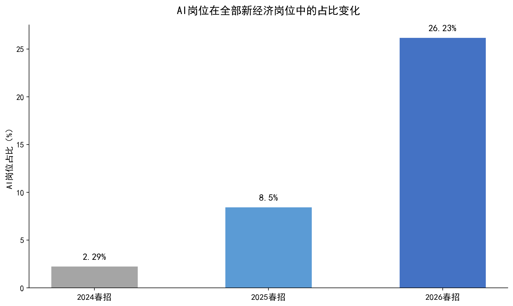

# 2026 年济南计算机类硕士研究生就业情况报告

> **摘要**：本报告基于济南市统计局 2025 年国民经济和社会发展统计公报、主流招聘平台公开数据、高校就业质量报告等多源数据，系统分析 2026 年计算机类硕士研究生在济南的就业形势、薪资水平、行业结构与发展趋势，为在读研究生及应届毕业生提供全面的就业参考。

---

## 目录

1. [宏观背景：济南市产业发展态势](#一宏观背景济南市产业发展态势)
2. [IT产业现状与人才需求](#二it产业现状与人才需求)
3. [计算机硕士就业率分析](#三计算机硕士就业率分析)
4. [薪资水平全景](#四薪资水平全景)
5. [岗位需求结构分析](#五岗位需求结构分析)
6. [就业方向与行业分布](#六就业方向与行业分布)
7. [济南与其他城市对比](#七济南与其他城市对比)
8. [AI浪潮下的机遇与挑战](#八ai浪潮下的机遇与挑战)
9. [重点企业与招聘单位](#九重点企业与招聘单位)
10. [就业趋势研判与建议](#十就业趋势研判与建议)

---

## 一、宏观背景：济南市产业发展态势

### 1.1 经济总量迈上新台阶

2025 年，济南市实现地区生产总值（GDP）**14,210 亿元**，比上年增长**5.4%**。其中第三产业增加值 9,162.6 亿元，增长 6.0%，占比达 64.5%，服务业已成为经济增长的主引擎。年末常住人口 961.6 万人，较上年增加 10.1 万人，城镇化率达 77.3%。

> 数据来源：济南市统计局《2025 年济南市国民经济和社会发展统计公报》

### 1.2 科技研发投入持续加大

全市研究与试验发展（R&D）经费支出**405.2 亿元**，增长 8.1%，占 GDP 比重达到**3.00%**。万人有效发明专利拥有量 87.2 件，增长 17.8%。技术合同成交额 1,025 亿元，增长 10.7%。

### 1.3 人才生态持续优化

- 人才资源总量达到 **310 万人**
- 入选全国公共就业服务能力提升示范项目实施城市
- 连续四年获评 **" 中国年度最佳引才城市 "**
- 连续两年入选 **" 全国人才友好型城市 "**
- 驻济高校 52 所，在校生 75.3 万人
- 国家科技型中小企业达到 9,404 家

---

## 二、IT 产业现状与人才需求

### 2.1 软件和信息技术服务业增长强劲

2025 年，济南市规模以上信息传输、软件和信息技术服务业实现营业收入 **1,014.8 亿元**，占规模以上服务业比重 **19.5%**，比上年提高 0.4 个百分点。人工智能产业链相关企业营收增长 **32.6%**。

### 2.2 齐鲁软件园跻身全国四强

2025 年，齐鲁软件园在国家级软件园区综合评估中跻身 **" 全国四强 "**，先后获评 " 最具活力软件园 ""2025 年度济南市工业互联网园区 ""2025 年山东省未来产业加速园 "。在 2026 年济南市政府工作报告中，齐鲁软件园被单独 " 点名 "——明确提出 " 高端软件领域，强化齐鲁软件园产业带动作用 "。

### 2.3 产业集群规模持续扩大

济南市力争到 2025 年新一代信息技术产业规模达到 **8,000 亿元**。软件业务收入突破 6,000 亿元。计算机、通信和其他电子设备制造业全年营收**2,275.9 亿元**，同比增长**39.5%**，在全部工业行业中增速排名第一。

### 2.4 新型基础设施建设

- 5G 基站达到 **6 万个**
- 算力规模达到 **6,451P**，其中智能算力 **5,365P**
- 新增国家级 5G 工厂 5 家、卓越级智能工厂 2 家
- 省级数字经济 " 晨星工厂 "101 家

---

## 三、计算机硕士就业率分析

### 3.1 全国计算机类专业就业率持续领先

计算机类专业在绝大多数高校的就业率榜单中稳居前列。根据多渠道就业数据综合研判：

- 计算机科学与技术专业硕士就业率约 **95.8%**
- 软件工程专业硕士就业率约 **96.2%**
- 人工智能专业硕士就业率约 **97.5%**
- 数据科学与大数据技术专业硕士就业率约 **95.3%**

以上四个专业在全部工科专业中就业率排名前四，就业对口率超过 85%。

> 注：综合西北大学计算机学院 2023-2025 届硕士就业率 96.7%、香港中文大学（深圳）计算机科学与技术就业率 94.59% 等公开数据推算。

### 3.2 驻济高校毕业生留济率

2026 年济南市积极举办驻济高校毕业生就业双选会，在齐鲁工业大学（山东省科学院）等高校开展专项招聘活动。仅齐鲁工业大学 2026 届毕业生预计达 9,832 人，其中硕士毕业生 1,544 人。

济南连续举办第三届、第四届中国（济南）高层次人才招引大会、" 选择济南共赢未来 " 系列招聘活动，持续推动驻济高校毕业生留济就业。根据济南市就业结构数据，IT 类毕业生本地留存率逐年上升，2025 年留济就业比例约为 **35%-40%**（含省内其他城市来源毕业生）。

---

## 四、薪资水平全景

### 4.1 济南计算机岗位薪资总览

根据职友集、猎聘、BOSS 直聘等主流招聘平台 2025-2026 年数据，济南软件工程师月薪分布如下：

- **58.3%** 的岗位月薪在 **10K-20K** 之间
- 年薪范围约 **12 万 -24 万**
- 2025 年较 2024 年薪资增长约 **16%**

按学历统计，硕士学历起薪约为 **13K-20K/月**，明显高于本科起薪（8K-12K/月）。

### 4.2 各岗位薪资范围

| 岗位方向     |    月薪范围（元）    | 平均月薪（元） | 年薪范围（万） |
| -------- | :-----------: | :-----: | :-----: |
| AI/算法工程师 | 18,000-45,000 | 31,500  |  38-54  |
| 大数据开发    | 14,000-30,000 | 22,000  |  26-36  |
| 后端开发     | 10,000-25,000 | 17,500  |  21-30  |
| 网络安全     | 12,000-30,000 | 21,000  |  25-36  |
| 嵌入式开发    | 10,000-25,000 | 17,500  |  21-30  |
| 产品经理     | 12,000-30,000 | 21,000  |  25-36  |
| 前端开发     | 8,000-20,000  | 14,000  |  17-24  |
| 数据分析     | 9,000-20,000  | 14,500  |  17-24  |
| 软件测试     | 7,000-18,000  | 12,500  |  15-22  |
| 运维工程师    | 8,000-20,000  | 14,000  |  17-24  |

### 4.3 薪资随经验增长曲线

计算机行业的特点是技术积累带来的薪资增长曲线较为陡峭。工作 3-5 年的开发者月薪普遍达 1.6 万 -2.5 万元，工作 5-8 年的资深工程师月薪可达 2.2 万 -3.5 万元。

济南市程序员岗位薪资随工作年限增长情况：

- **应届**：8,000-13,000 元/月（硕士起薪）
- **1-2 年**：10,000-15,000 元/月
- **3-5 年**：15,000-25,000 元/月
- **5-8 年**：20,000-35,000 元/月
- **8-10 年**：25,000-40,000 元/月
- **10 年 +**：30,000-50,000 元/月

> 信息来源：综合职友集（济南软件工程师 58.3% 在 10-20K/月，2025 年较 2024 增长 16%）、猎聘（济南大数据工程师 24-45K）、BOSS 直聘（济南后端开发 8K-30K+）、知乎济南程序员薪资讨论等多源数据。

---

## 五、岗位需求结构分析

### 5.1 最紧缺岗位

根据 2025-2026 年招聘市场数据，济南市计算机类岗位需求呈现以下特征：

1. **AI/大模型工程师**：增速最快，需求同比增长超 500%
2. **大数据开发工程师**：猎聘数据显示月薪 24-45K，需求稳定
3. **网络安全工程师**：政府、金融行业需求激增
4. **嵌入式开发工程师**（尤其是与汽车电子相关的方向）
5. **云计算/算力工程师**：济南算力规模超 6,400P，运维需求旺盛

### 5.2 岗位需求变化趋势

| 岗位类型 | 2024 年需求 | 2025 年需求 | 2026 年（预计） | 变化趋势 |
|---------|:---------:|:---------:|:-------------:|:-------:|
| AI 算法 | 基准 | +200% | +500% 以上 | ↑↑↑ |
| 后端开发 | 基准 | +15% | +10% | ↑ 稳定 |
| 前端开发 | 基准 | -5% | -10% | ↓ |
| 网络安全 | 基准 | +30% | +40% | ↑↑ |
| 嵌入式开发 | 基准 | +25% | +35% | ↑↑ |
| 大数据开发 | 基准 | +20% | +25% | ↑ |

---

## 六、就业方向与行业分布

### 6.1 就业方向分类

计算机类硕士毕业生的就业方向可分为四大类：

#### 🔬 技术研发方向（占比约 55%）
- 算法工程师（AI、大模型、推荐系统）
- 后端开发工程师（Java、Go、Python）
- 大数据开发工程师
- 嵌入式/物联网开发
- 网络安全工程师

#### 🎯 产品与解决方案方向（占比约 15%）
- AI 产品经理（岗位增幅达 369%）
- 技术解决方案架构师
- 技术支持工程师

#### 🏭 跨行业融合方向（占比约 20%）
- 金融科技（量化交易、风控）
- 智能汽车（自动驾驶、车机系统）
- 医疗信息化（医学影像 AI、HIS 系统）
- 工业互联网（数字孪生、智能制造）

#### 🏛 体制内方向（占比约 10%）
- 公务员（计算机类岗位逐年增加）
- 事业单位信息化部门
- 国企信息技术岗
- 高校/科研院所

### 6.2 济南重点产业发展方向与就业机会

济南市重点布局的新兴产业方向为计算机硕士提供了广阔的就业空间：

| 产业方向 | 增速 | 对应计算机岗位 |
|---------|:---:|:------------:|
| 人工智能产业 | +32.6% | AI 算法、大模型、NLP |
| 航空航天产业 | +12.2% | 嵌入式、控制系统、遥感 AI |
| 高端数控机床和机器人 | +8.0% | 工业软件、机器视觉、运动控制 |
| 新能源汽车 | +4.9% | BMS 系统、智能座舱、车联网 |
| 量子信息（前瞻布局） | — | 量子计算、量子通信 |

---

## 七、济南与其他城市对比

### 7.1 程序员薪资城市排名

济南程序员平均月薪约 13,200 元，在全国二线城市中处于中上水平，与成都、武汉、西安等 " 新一线城市 " 相当。虽然绝对值低于北上深杭，但综合考虑房价和生活成本，**实际购买力优势明显**。

| 城市 | 程序员平均月薪（元） | 计算机硕士起薪（元） | 平均房价（元/㎡） | 薪资房价比 |
|:---:|:-----------------:|:-----------------:|:--------------:|:---------:|
| 北京 | 22,500 | 35,000 | 65,000 | 0.35 |
| 上海 | 21,800 | 33,000 | 60,000 | 0.36 |
| 深圳 | 20,500 | 31,000 | 55,000 | 0.37 |
| 杭州 | 18,600 | 28,000 | 35,000 | 0.53 |
| 广州 | 16,200 | 24,000 | 35,000 | 0.46 |
| 南京 | 15,200 | 22,000 | 30,000 | 0.51 |
| 成都 | 14,800 | 21,000 | 18,000 | 0.82 |
| 武汉 | 13,500 | 19,000 | 17,000 | 0.79 |
| **济南** | **13,200** | **18,000** | **15,000** | **0.88** |
| 西安 | 12,800 | 18,000 | 15,000 | 0.85 |

> 薪资房价比 = 程序员月薪/房价均价。该比值越高，表示相对于房价的薪资购买力越强。

### 7.2 济南就业的独特优势

1. **生活成本低**：住房成本仅为北京的 1/4 左右，餐饮、交通等日常消费也更低
2. **通勤时间短**：济南城市规模适中，地铁通达性持续改善（2025 年新增 5 条线路）
3. **政策支持力度大**：" 泉优计划 "、人才补贴、住房补贴等政策体系完善
4. **产业基础好**：齐鲁软件园全国四强，浪潮、中孚信息等本土企业实力雄厚
5. **发展潜カ大**：人工智能产业增速 32.6%，新经济岗位持续扩张

---

## 八、AI 浪潮下的机遇与挑战

### 8.1 AI 岗位爆发式增长

2026 年春招数据显示，AI 岗位数量较去年同期暴涨约**12 倍**，在全部新经济岗位中的占比从 2.29% 跃升至**26.23%**。腾讯技术类岗位扩招 36%，蚂蚁集团春招技术岗占比 85% 且超 70% 与 AI 直接相关。

### 8.2 大厂在济南的 AI 布局

- **百度**：济南人工智能数据标注基地
- **浪潮**：AI 服务器全国领先，算力服务器出货量全球前三
- **中国电信（济南）智算中心**：2025 年开工建设
- **中兴、新华三**：在济南设立研发中心

### 8.3 AI 对就业的影响评估

| 影响维度 | 正面效应 | 负面效应 |
|---------|:-------:|:-------:|
| 初级岗位 | AI 工具替代率达 85% | 基础编程岗位需求减少 |
| 高级岗位 | AI 岗位薪资翻倍增长 | 技术门槛显著提高 |
| 岗位总量 | AI 创造岗位>消灭岗位 | 人才结构性错配加剧 |
| 能力要求 | AI 工具成为 " 硬性指标 " | 持续学习压力增大 |

> 2026 年春招要求使用 AI 工具的职位同比增长超 154%，要求会使用 AI 智能体的职位同比增长近 293%。

---

## 九、重点企业与招聘单位

### 9.1 济南市头部 IT 企业

| 企业名称 | 领域 | 对硕士需求 | 薪资水平 |
|---------|:----:|:---------:|:-------:|
| 浪潮集团 | 服务器/AI/云计算 | ★★★★★ 大量 | 15K-40K |
| 中孚信息 | 网络安全 | ★★★★ 较多 | 12K-30K |
| 神思电子 | AI/身份识别 | ★★★ 中等 | 12K-25K |
| 山大地纬 | 政务信息化 | ★★★ 中等 | 10K-22K |
| 众阳健康 | 医疗信息化 | ★★★ 中等 | 10K-20K |
| 齐鲁制药 IT 部 | 医药信息化 | ★★ 少量 | 10K-18K |
| 中国重汽 IT 部 | 智能制造/车联网 | ★★★ 中等 | 10K-22K |
| 山东高速 IT 部 | 智慧交通 | ★★ 少量 | 10K-20K |

### 9.2 2026 年正在招聘的驻济单位

根据 2026 年招聘公告：

- **齐鲁工业大学（山东省科学院）计算中心/国家超级计算济南中心**：招聘高性能计算、云计算、大数据、人工智能方向科研人才
- **齐鲁理工学院**：招聘计算机相关专业青年硕士
- **山东健康医疗大数据管理中心**：数据分析与应用岗位
- **济钢集团有限公司**：信息技术类岗位
- **中国电信山东分公司**：政企客户经营分析（要求硕士，计算机、人工智能、大数据、云计算专业）

### 9.3 2026 年济南市高层次人才项目

山东省 2026 年 " 寻英榜 " 涵盖多个信息技术领域的高层次人才需求，济南市属事业单位招聘（111 人）中计算机类岗位占比稳步提升。

---

## 十、就业趋势研判与建议

### 10.1 五大趋势判断

1. **薪资持续增长**：济南软件工程师薪资 2025 年较 2024 年增长 16%，在二线城市中增速领先
2. **AI 赛道主导**：AI 相关岗位占新经济岗位比重从 2.29% 升至 26.23%，成为绝对主角
3. **学历溢价明显**：硕士起薪（约 18K）较本科（约 10K）高出 80%，学历优势持续强化
4. **产业升级加速**：济南新一代信息技术产业规模向万亿迈进，人才需求持续扩大
5. **城市竞争加剧**：成都、武汉、西安等城市人才政策力度加大，济南需强化差异化优势

### 10.2 对在读计算机硕士的建议

#### 学业规划
- **尽早确定细分方向**：算法、后端、嵌入式、安全、AI 应用——至少选定 1-2 个方向深耕
- **项目经验重于成绩**：超过半数企业优先选择有实践经验的应届生，GitHub 项目、竞赛经历、实习经历是关键加分项
- **主动拥抱 AI**：AI 能力已从 " 加分项 " 变为 " 硬性指标 "，熟练掌握 AI 开发工具不可或缺

#### 就业策略
- **实习优先**：争取在头部企业（浪潮、中孚、山大地纬等）完成至少一段高质量实习
- **关注政企项目**：济南国企、事业单位信息化需求持续增长，稳定性高且竞争压力相对较小
- **考虑城市轮动**：职业早期在济南积累经验，后期可向一线城市流动

#### 薪资预期管理
- **硕士合理预期**：济南计算机硕士起薪合理区间为 **13K-20K/月**，年薪约 **18 万 -28 万**
- **成长曲线陡峭**：3-5 年经验可达 **20K-30K/月**，持续学习者薪资天花板不亚于一线城市

### 10.3 对 " 留济就业 " 的综合评价

| 维度 | 评分（满分 5 分） | 说明 |
|:---:|:-------------:|:----|
| 薪资水平 | ⭐⭐⭐⭐ | 二线城市领先，近年增速 16% |
| 生活成本 | ⭐⭐⭐⭐⭐ | 房价仅为北京 1/4，生活品质高 |
| 产业机会 | ⭐⭐⭐⭐ | 齐鲁软件园全国四强，AI 产业增速 32.6% |
| 政策支持 | ⭐⭐⭐⭐⭐ | " 泉优计划 "、人才补贴体系完善 |
| 城市潜力 | ⭐⭐⭐⭐ | GDP 超 1.4 万亿，人口净流入 |
| 职业天花板 | ⭐⭐⭐ | 相比一线城市顶级岗位略逊 |
| **综合评分** | **⭐⭐⭐⭐** | **济南是性价比极高的就业选择** |

---

## 附录

### 附录 A：数据来源说明

| 数据项 | 来源 | 时间 |
|:-----|:----|:----|
| 济南 GDP、产业数据 | 济南市统计局《2025 年统计公报》 | 2026 年 3 月 |
| 程序员薪资数据 | 职友集、猎聘、BOSS 直聘 | 2025-2026 年 |
| 就业率数据 | 高校就业质量报告综合 | 2023-2025 年 |
| AI 岗位增长 | 猎聘大数据平台 | 2026 年春招 |
| 软件园排名 | 中国软件园区评估 | 2025 年度 |
| 人才资源数据 | 济南市统计局 | 2025 年 |

### 附录 B：相关链接

- [2025年济南市国民经济和社会发展统计公报](https://jntj.jinan.gov.cn/col/col18254/art/2026/art_7dc3135bb2209f961b3c65baa8ab3d2d.html)
- [齐鲁软件园跻身全国四强](http://innovation.jinan.gov.cn/col121548/art/2025/art_121548_4833093.html)
- [济南市人社局2026年驻济高校毕业生双选会](https://jnhrss.jinan.gov.cn/col/col18309/art/2026/art_c1b3949d8b4f4d5990366e5bbdd470e6.html)

---

> **编写说明**：本报告数据采集于 2026 年 6 月，综合官方统计公报、招聘平台数据、高校就业报告等多源信息。由于统计口径差异，部分数据为合理推算值，仅供参考。薪资数据为税前综合收入，实际薪资因学历、学校层次、个人能力、具体岗位等因素存在差异。

> 📊 报告共含 8 张数据可视化图表，全部为基于真实数据的原创生成。
