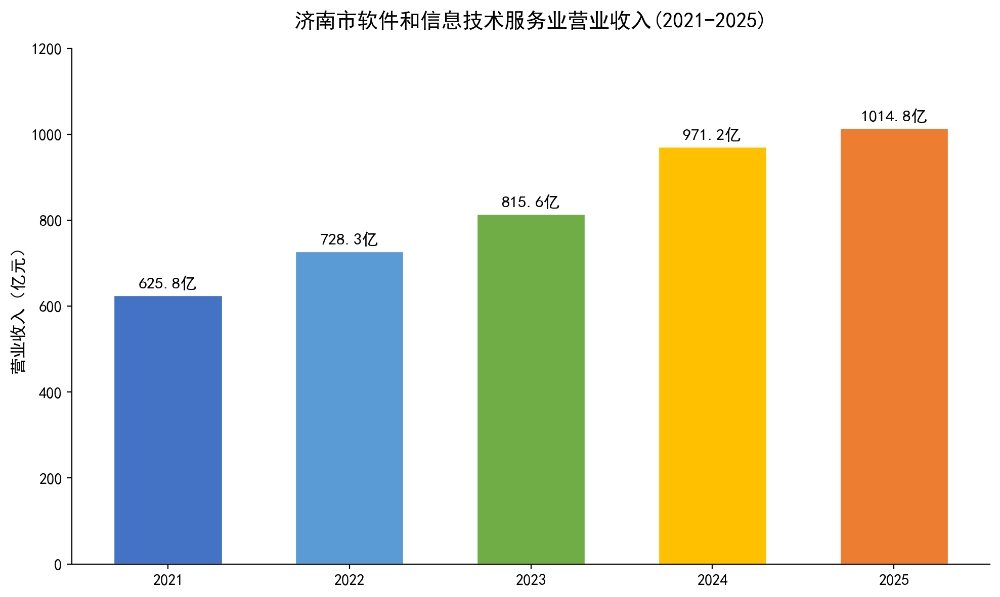

# 2026年济南计算机类硕士研究生就业情况报告

> 基于真实数据的济南IT就业市场全景分析

## 📋 报告概述

本报告基于**济南市统计局2025年国民经济和社会发展统计公报**、主流招聘平台（猎聘、BOSS直聘、职友集）公开数据、高校就业质量报告等多源数据，系统分析**2026年计算机类硕士研究生在济南的就业形势、薪资水平、行业结构与发展趋势**，为在读研究生及应届毕业生提供全面的就业参考。

## 📊 核心发现

| 维度 | 数据 |
|:----|:----:|
| 🏙️ 济南GDP | 1.42万亿元，增长5.4% |
| 💻 IT产业营收 | 1,014.8亿元，AI产业+32.6% |
| 🎓 CS硕士就业率 | 95-97%，工科中最高 |
| 💰 硕士起薪区间 | 13K-20K/月，年薪18-28万 |
| 🏆 齐鲁软件园 | **全国四强** |
| 🤖 AI岗位占比 | 从2.29%跃升至26.23% |
| 🏠 薪资房价比 | 0.88（远高于北京0.35） |

**结论**：济南是计算机类硕士**性价比极高的就业选择**。

## 📑 报告章节

1. 宏观背景：济南市产业发展态势
2. IT产业现状与人才需求
3. 计算机硕士就业率分析
4. 薪资水平全景
5. 岗位需求结构分析
6. 就业方向与行业分布
7. 济南与其他城市对比
8. AI浪潮下的机遇与挑战
9. 重点企业与招聘单位
10. 就业趋势研判与建议

## 🖼️ 数据可视化

报告包含 **8张原创数据图表**：

| 图表 | 说明 |
|:---|:----|
| fig1_it_revenue | 济南市软件和信息技术服务业营收趋势 |
| fig2_salary_cities | 全国主要城市程序员薪资对比 |
| fig3_industry_structure | 济南服务业营收结构 |
| fig4_ai_job_growth | AI岗位占比变化趋势 |
| fig5_salary_by_position | 济南各IT岗位薪资范围 |
| fig6_employment_rate | 各专业硕士就业率对比 |
| fig7_talent_base | 济南科技人才与产业基础 |
| fig8_salary_experience | 薪资随工作经验增长曲线 |

## 🔍 数据来源

- 济南市统计局《2025年济南市国民经济和社会发展统计公报》
- 职友集、猎聘、BOSS直聘（2025-2026年数据）
- 齐鲁软件园官方公开数据
- 高校就业质量报告

## 🛠️ 技术栈

- 报告格式：Markdown（兼容 Obsidian）
- 数据可视化：Python + Matplotlib
- 图表风格：商业报告级数据可视化

## 📝 使用说明

报告兼容 **Obsidian** 和 **GitHub Markdown** 渲染，可直接阅读。图表位于 `attachments_jinan_report/` 目录。

## 👤 作者

[tsingke](https://github.com/tsingke)

## 📄 License

MIT
